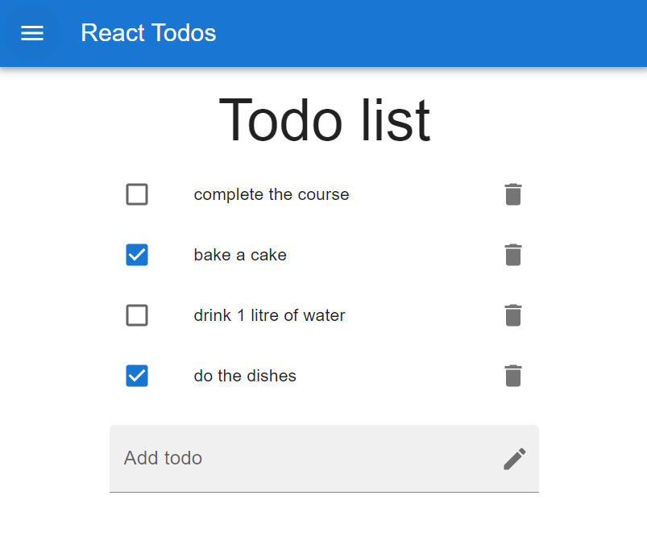

# React Todo List Application

A simple, responsive Todo List app built with React and Material UI.

## Demo

## Features

-  Add, complete, and delete tasks
-  Persistent storage with localStorage
-  Responsive Material UI design

## Tech Stack

-  React
-  Material UI
-  localStorage API

## Project Structure

-  `App.jsx`: Main component with Navbar and TodoList
-  `TodoList.jsx`: Manages todos state and operations
-  `TodoForm.jsx`: Input form for new todos
-  `TodoItem.jsx`: Individual todo item component

## How It Works

Todo items contain:

-  Unique ID
-  Text content
-  Completion status

Operations:

-  Add new todos
-  Toggle completion status
-  Delete todos

Data persists between sessions via localStorage.
